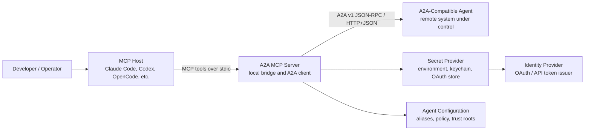
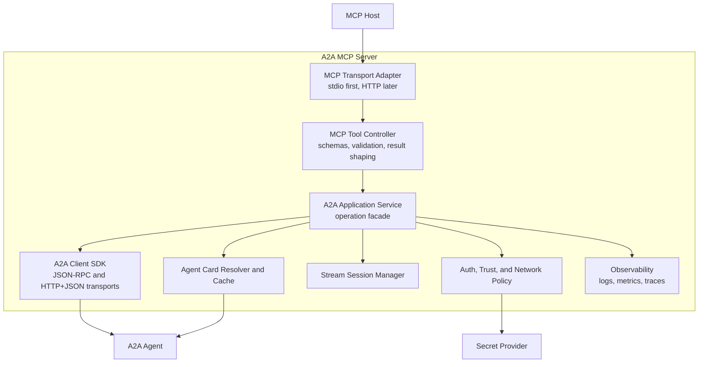
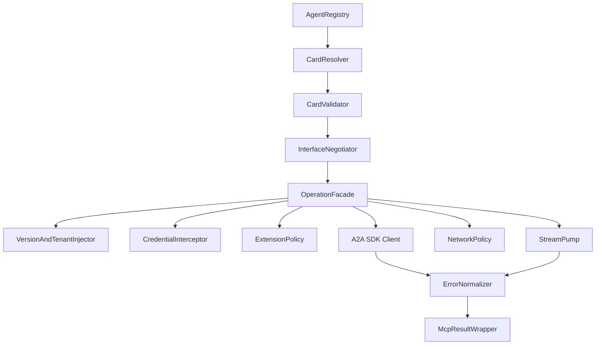
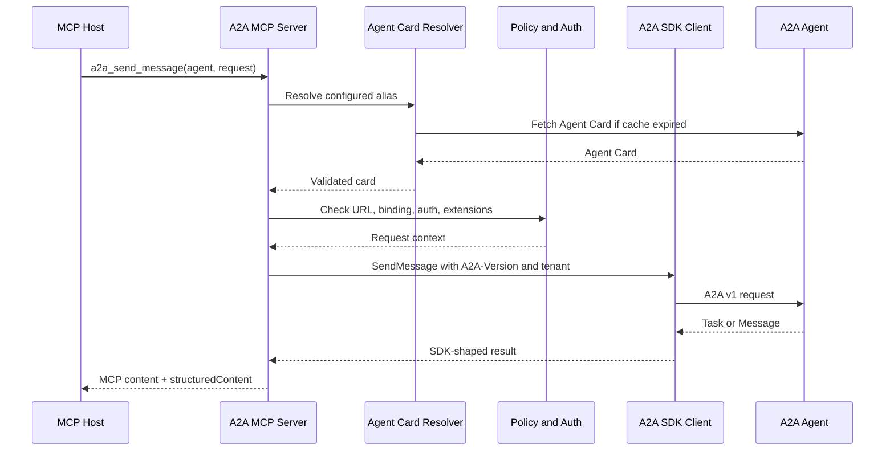
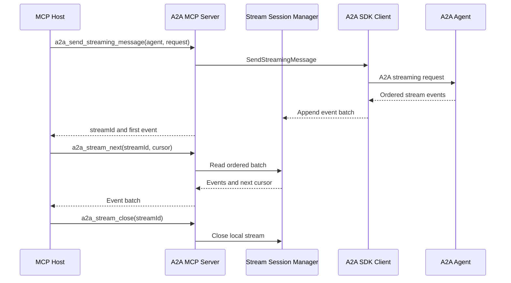
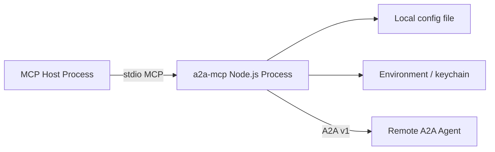

# A2A MCP Server Design

Status: Proposed  
Target protocol: A2A v1.0  
Primary audience: implementers and reviewers of the MCP server  
Last updated: 2026-07-23

## Executive Summary

This project will implement an MCP server that acts as an A2A v1 client. MCP hosts such as Claude Code, Codex, OpenCode, and other tool-capable clients will call local MCP tools. The server will translate those calls into conformant A2A v1 client operations against configured A2A-compatible agents.

The MCP server is not itself an A2A agent in the initial scope. It is a bridge: MCP on the local side, A2A client behavior on the remote side.

The design uses the official A2A v1 protocol model as the source of truth, supports JSON-RPC and HTTP+JSON, and exposes every core A2A client operation through MCP tools. The implementation uses the official A2A SDK instead of reimplementing wire formats by hand. gRPC is intentionally out of scope for this implementation.

## Goals

- Provide an MCP server that lets MCP hosts communicate with A2A-compatible agents.
- Conform to the A2A v1.0 client requirements for versioning, transport negotiation, request shapes, response shapes, errors, streaming, task handling, tenant handling, and extensions.
- Support the required near-term A2A v1 protocol bindings:
  - JSON-RPC
  - HTTP+JSON
- Keep the transport surface focused on JSON-RPC and HTTP+JSON.
- Expose all core A2A v1 client operations as MCP tools.
- Accept A2A-shaped request JSON at the MCP boundary while delegating detailed protocol conversion and response shaping to the official SDK.
- Keep credentials out of model-visible tool arguments and results.
- Provide a practical streaming bridge for MCP hosts that do not expose raw A2A streams directly.
- Build a test strategy that separates SDK-owned wire serialization from bridge-owned client behavior.

## Non-Goals

- Implementing an A2A server role.
- Implementing automatic downgrade to pre-v1 A2A protocol versions.
- Fetching arbitrary artifact URLs automatically.
- Exposing credentials, tokens, private keys, or OAuth refresh tokens through MCP tool arguments.
- Guaranteeing push-notification webhook hosting in the first local-stdio release.
- Reimplementing the official SDK's detailed A2A transport mapping.

## Architecture Decisions

| ID | Decision | Rationale |
| --- | --- | --- |
| D1 | Build in TypeScript on Node.js 20+. | Aligns with the official JavaScript A2A SDK and the broad MCP server ecosystem. |
| D2 | Use the official A2A v1 SDK for wire bindings where possible. | The A2A protobuf model is normative; using generated SDK behavior reduces subtle JSON/protobuf/binding drift. |
| D3 | Pin A2A v1.0 behavior and reject incompatible protocol versions by default. | The user requirement is A2A v1 conformance, and silent downgrade would hide interoperability failures. |
| D4 | Support JSON-RPC and HTTP+JSON. | These bindings cover the requested bridge without adding gRPC implementation and test complexity. |
| D5 | Ship local MCP stdio first; add Streamable HTTP later if needed. | Stdio is the lowest-friction integration path for local coding agents. |
| D6 | Use configured agent aliases by default; direct URLs are opt-in. | A model-visible tool surface that accepts URLs can become an SSRF primitive without strict policy. |
| D7 | Keep the bridge thin around A2A payloads. | The official SDK should own detailed A2A request/response conversion; the bridge should own MCP ergonomics, auth, policy, tenant handling, and streams. |
| D8 | Treat A2A streams as local stream sessions. | MCP tool calls are request/response; a bounded stream session gives hosts a reliable polling surface. |
| D9 | Do not include server TCK machinery in this client bridge package. | The TCK tests A2A servers; this package proves bridge-owned client behavior locally and delegates transport serialization to the SDK. |

## C4 Level 1: System Context



At this level, the MCP server is the only new system. It sits between tool-capable coding assistants and existing A2A agents. The model can ask to send a message, get a task, cancel a task, or read a stream, but the bridge owns protocol negotiation, security policy, credentials, and wire correctness.

## C4 Level 2: Containers



### Container Responsibilities

| Container | Responsibility |
| --- | --- |
| MCP Transport Adapter | Starts the MCP server, registers tools, accepts stdio requests, and later can expose Streamable HTTP. |
| MCP Tool Controller | Validates MCP tool input, applies ergonomic defaults, invokes the application service, and returns both text and structured results. |
| A2A Application Service | Owns A2A operation semantics, capability checks, binding selection, fallback rules, and error normalization. |
| Agent Card Resolver and Cache | Discovers agent cards from configured aliases, direct URLs when allowed, registries, or well-known URLs; validates and caches them. |
| Auth, Trust, and Network Policy | Resolves credentials out-of-band, enforces URL policy, validates TLS expectations, verifies signatures when configured, and redacts secrets. |
| Stream Session Manager | Converts A2A streaming operations into local stream sessions with ordered buffers and lifecycle management. |
| A2A Client SDK | Performs standard binding-specific serialization, headers, metadata, tenants, and transport calls. |
| Observability | Records sanitized logs, metrics, traces, selected binding, latency, retries, and ambiguous outcomes. |

## C4 Level 3: A2A Client Components



| Component | Responsibility |
| --- | --- |
| AgentRegistry | Maps model-safe aliases to configured agent endpoints, auth profiles, and policy overrides. |
| CardResolver | Fetches public and extended Agent Cards using well-known URLs, explicit URLs, or registries. |
| CardValidator | Validates protocol version, required fields, declared capabilities, interfaces, signatures, and extensions. |
| InterfaceNegotiator | Selects the first locally supported standard binding in the agent's declared preference order. |
| VersionAndTenantInjector | Adds `A2A-Version: 1.0` and applies the exact AgentInterface tenant to every request when present. |
| CredentialInterceptor | Adds credentials from secret profiles without exposing them to MCP callers. |
| ExtensionPolicy | Adds `A2A-Extensions` and blocks required extensions without installed handlers. |
| OperationFacade | Implements the eleven A2A client operations and bridge-only stream helpers. |
| StreamPump | Reads ordered A2A stream events into bounded local buffers. |
| ErrorNormalizer | Preserves protocol errors and maps them into stable MCP error results. |
| McpResultWrapper | Returns human-readable content plus SDK-shaped structured content and bridge metadata. |
| NetworkPolicy | Enforces SSRF protections, redirect policy, DNS checks, TLS expectations, and size/time limits. |

## A2A Operation Coverage

The MCP server must expose the A2A v1 client operation set. Tool input should use canonical A2A camelCase field names and enum string values.

| A2A operation | MCP tool | Notes |
| --- | --- | --- |
| SendMessage | `a2a_send_message` | Sends a message. Tool-layer default should be `returnImmediately: true`; callers can override. |
| SendStreamingMessage | `a2a_send_streaming_message` | Starts a local stream session and returns `streamId` plus the first event when available. |
| GetTask | `a2a_get_task` | Idempotent read. Safe to retry or fall back before response ambiguity. |
| ListTasks | `a2a_list_tasks` | Idempotent read. |
| CancelTask | `a2a_cancel_task` | A2A treats cancel as idempotent, but not all remote task histories are permanent. |
| SubscribeToTask | `a2a_subscribe_to_task` | Starts a local subscription session. The first A2A event should represent current task state. |
| CreateTaskPushNotificationConfig | `a2a_create_push_notification_config` | Requires remote push-notification support and local webhook strategy. |
| GetTaskPushNotificationConfig | `a2a_get_push_notification_config` | Idempotent read. |
| ListTaskPushNotificationConfigs | `a2a_list_push_notification_configs` | Idempotent read. |
| DeleteTaskPushNotificationConfig | `a2a_delete_push_notification_config` | Idempotent delete. |
| GetExtendedAgentCard | `a2a_get_extended_agent_card` | Requires auth when the agent uses protected extended cards. |
| Bridge helper | `a2a_list_agents` | Lists configured aliases and cached card summaries. |
| Bridge helper | `a2a_get_agent_card` | Resolves and returns the public Agent Card. |
| Bridge helper | `a2a_stream_next` | Long-polls a local stream buffer and returns ordered event batches. |
| Bridge helper | `a2a_stream_close` | Closes only the local stream session; it must not cancel the remote task. |

## MCP Tool Contract

Every protocol-facing tool should follow this shape:

```json
{
  "agent": "research-agent",
  "request": {
    "message": {
      "messageId": "optional-client-generated-id",
      "role": "ROLE_USER",
      "parts": [
        {
          "text": "Analyze this repository."
        }
      ]
    },
    "returnImmediately": true
  }
}
```

The `agent` value is normally a configured alias. Direct agent-card URLs can be enabled for development or trusted environments, but must be disabled by default.

Responses should include both MCP `content` and `structuredContent`:

```json
{
  "content": [
    {
      "type": "text",
      "text": "Task TASK_STATE_WORKING from research-agent."
    }
  ],
  "structuredContent": {
    "result": {
      "task": {
        "id": "task-123",
        "state": "TASK_STATE_WORKING"
      }
    },
    "_bridge": {
      "agent": "research-agent",
      "protocolVersion": "1.0",
      "selectedBinding": "JSONRPC",
      "ambiguousOutcome": false
    }
  }
}
```

The `result` member should preserve SDK-shaped A2A response data. The `_bridge` member is local metadata for MCP hosts and tests.

## Runtime Flow: Discovery and Unary Send



The application service must choose a binding from the agent's `supportedInterfaces` in server-declared preference order. It should only fall back before bytes are sent, for idempotent reads, or when the operation is known not to have been applied. If a write outcome is ambiguous, the bridge returns an error with `ambiguousOutcome: true` instead of silently retrying.

## Runtime Flow: Streaming Bridge



The bridge must not reorder stream events. It should maintain a bounded ring buffer per stream session and report overflow explicitly. If overflow occurs, callers recover with `a2a_get_task` or a new `a2a_subscribe_to_task` call.

The bridge should not silently reconnect streams. A2A stream events do not provide a universal event-id replay contract, so reconnects can create missing or duplicated status messages. Explicit resubscribe keeps that behavior visible.

## A2A Conformance Requirements

| Area | Requirement |
| --- | --- |
| Versioning | Send `A2A-Version: 1.0` on every A2A HTTP request. Reject unsupported major/minor versions by default. |
| Data model | Use the v1 protobuf-generated model as the source of truth. JSON uses camelCase fields and exact enum names. |
| Bindings | Implement JSON-RPC and HTTP+JSON through standard transport factories. |
| Interface selection | Respect Agent Card `supportedInterfaces` order and use the selected interface URL. |
| Tenant | Inject the exact AgentInterface tenant into every request when provided. |
| Capabilities | Gate streaming, push notifications, and extended cards on Agent Card capability declarations. |
| Agent Card | Support well-known discovery, configured direct cards, caching, conditional fetch, extended cards, and fail-closed signature policy until verification is configured. |
| Extensions | Send `A2A-Extensions` only for supported extensions. Fail clearly when a required extension is unsupported. |
| Message parts | Preserve text, raw bytes, URL, and data parts; avoid automatic URL dereference. |
| Task state | Preserve A2A task states including `TASK_STATE_INPUT_REQUIRED` and `TASK_STATE_AUTH_REQUIRED`. |
| Errors | Preserve A2A error code, message, and details; normalize into MCP `isError: true` responses. |
| Streaming | Preserve event order, expose terminal stream closure, and never treat local stream close as remote task cancellation. |

## Error Handling

The bridge should normalize transport and protocol failures into a stable MCP error envelope:

```json
{
  "isError": true,
  "content": [
    {
      "type": "text",
      "text": "A2A task task-123 was not found."
    }
  ],
  "structuredContent": {
    "error": {
      "code": -32001,
      "name": "TaskNotFoundError",
      "message": "Task not found",
      "details": {},
      "category": "protocol",
      "binding": "JSONRPC",
      "retriable": false,
      "ambiguousOutcome": false
    }
  }
}
```

Known A2A v1 error codes that must be preserved include task-not-found, task-not-cancelable, push-notification-not-supported, unsupported-operation, content-type-not-supported, invalid-agent-response, extended-agent-card-not-configured, extension-support-required, and version-not-supported.

## Security Model

The bridge is a local tool that can reach remote URLs on behalf of a model, so the secure default is deny-by-default network access except for configured agent aliases.

Required controls:

- Direct URLs disabled by default.
- Production traffic requires HTTPS.
- Deny private, loopback, link-local, multicast, and reserved IP ranges unless an explicit development profile allows them.
- Re-resolve DNS per connection and enforce policy on redirects.
- Bind credentials to exact allowed origins.
- Validate TLS certificates by default.
- Keep secrets in environment variables, OS keychain, or OAuth stores, never in MCP tool schemas.
- Redact authorization headers, cookies, tokens, private keys, and signed URLs in logs and errors.
- Enforce request and response size limits, stream buffer limits, base64 size limits, per-agent concurrency limits, and operation timeouts.
- Do not automatically fetch `Part.url` payloads. Return the URL and metadata to the caller.
- Fail closed on Agent Card signatures until trust-root-backed verification is configured: `required` rejects unsigned cards, `ifPresent` rejects signed cards that cannot be verified, and `disabled` is reserved for explicitly trusted development targets.

## Configuration Model

Initial configuration should be file-backed, with environment-variable expansion for secret profile names but not secret values:

```yaml
agents:
  research:
    cardUrl: "https://agent.example.com/.well-known/agent-card.json"
    authProfile: "research-prod"
    allowedBindings: ["JSONRPC", "HTTP+JSON"]
    signaturePolicy: "ifPresent"
    directUrlPolicy: "disabled"

authProfiles:
  research-prod:
    type: "bearer-env"
    env: "A2A_RESEARCH_TOKEN"
  research-m2m:
    type: "oauth-client-credentials-env"
    tokenUrl: "https://auth.example.com/oauth/token"
    clientIdEnv: "A2A_RESEARCH_CLIENT_ID"
    clientSecretEnv: "A2A_RESEARCH_CLIENT_SECRET"
    scope: "a2a:send a2a:read"
    audience: "https://agent.example.com"
    authMethod: "client_secret_basic"

network:
  allowPrivateAddresses: false
  requireHttps: true
  timeoutMs: 30000
  maxResponseBytes: 10485760
```

## Deployment View

### Local Stdio MVP



This deployment is best for Claude Code, Codex, OpenCode, and similar local tools. Each host starts the MCP server process and communicates over stdio.

### Future Shared Service

A future deployment can expose MCP Streamable HTTP for teams that want a shared bridge. That version needs stronger multi-tenant isolation, request authentication, audit logging, and durable stream/session storage.

## Testing and Conformance Strategy

Testing must prove two different things:

| Layer | Proof |
| --- | --- |
| A2A client bridge behavior | Run a client-specific harness that inspects bridge-owned outbound headers, auth, tenant handling, defaults, errors, and streams. Rely on the SDK for detailed operation serialization. |
| MCP bridge behavior | Run MCP integration tests that call every tool and verify `content`, `structuredContent`, error mapping, stream cursors, and secret redaction. |

Recommended CI jobs:

1. Static checks: TypeScript, linting, schema generation drift, markdown checks.
2. Unit tests: policy, config, Agent Card validation, operation facade, error normalization, stream buffers.
3. Client harness tests: programmable fake A2A endpoints for JSON-RPC and HTTP+JSON.
4. Security tests: SSRF deny cases, redirect policy, DNS rebinding simulation, secret redaction.

## Implementation Phases

| Phase | Outcome |
| --- | --- |
| 0. Scaffold and protocol pins | Create TypeScript package, pin Node.js, MCP SDK, A2A SDK, generated protocol artifacts, config schema, and CI skeleton. |
| 1. Unary MVP | Implement stdio MCP server, agent aliases, card resolution, JSON-RPC and HTTP+JSON unary operations, errors, and basic tests. |
| 2. Streams | Add streaming session manager, subscribe support, stream read/close tools, and event-order tests. |
| 3. Full A2A surface | Add task listing, push-notification config tools, extended cards, extension policy, and capability gates. |
| 4. Hardening | Add robust auth profiles, signature verification, SSRF protections, observability, and release packaging. |

## Acceptance Criteria

- An MCP host can list configured A2A agents and fetch their public Agent Cards.
- The bridge rejects incompatible Agent Cards and unsupported required extensions with clear errors.
- The bridge selects JSON-RPC or HTTP+JSON from `supportedInterfaces` according to configured policy and the server's declared order.
- Every outbound A2A request includes protocol version information and tenant information when applicable.
- All eleven A2A v1 client operations are exposed as MCP tools.
- Streaming operations return ordered events through local stream sessions.
- Local stream closure does not cancel remote tasks.
- Credentials never appear in tool schemas, tool inputs, tool outputs, logs, or thrown errors.
- Tests cover transport negotiation, headers, tenant injection, tool contracts, error mapping, retry/fallback behavior, and streaming buffer behavior without duplicating the SDK's full transport suite.
- CI includes local bridge checks, client harness tests, packaging checks, and dependency audit checks.

## Risks and Open Decisions

| Topic | Recommended default | Reason |
| --- | --- | --- |
| Direct URL tools | Disabled by default, enabled only in explicit development profiles. | Prevents model-driven SSRF. |
| Push notification receiving | Expose config CRUD first; add hosted receiver later. | Local stdio processes are poor webhook targets. |
| OAuth UX | Support machine-to-machine client credentials and bearer/API-key profiles first; add device and PKCE flows after core protocol works. | Keeps first implementation testable while covering service-to-service agents. |
| Signature verification | Default `ifPresent`; allow per-agent `required`. | Balances interoperability with stronger trust settings. |
| Stream persistence | In-memory for stdio MVP; durable storage only for shared HTTP service. | Local hosts normally own process lifetime. |
| Retry policy | Conservative retry for idempotent reads; no silent write retry on ambiguous outcome. | Avoids duplicate task mutation. |

## References

- [A2A v1 specification](https://a2a-protocol.org/latest/specification/)
- [A2A protocol repository](https://github.com/a2aproject/A2A)
- [Model Context Protocol specification](https://modelcontextprotocol.io/specification)
